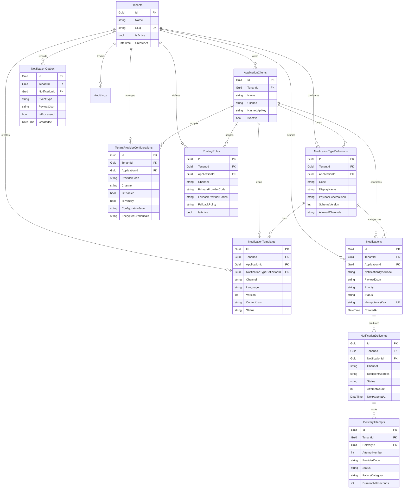

# Multi-Tenant Notification Gateway — Database ERD

```mermaid
erDiagram
    Tenants ||--o{ ApplicationClients : "owns"
    Tenants ||--o{ NotificationTypeDefinitions : "configures"
    Tenants ||--o{ NotificationTemplates : "creates"
    Tenants ||--o{ Notifications : "submits"
    Tenants ||--o{ TenantProviderConfigurations : "manages"
    Tenants ||--o{ RoutingRules : "defines"
    Tenants ||--o{ NotificationOutbox : "records"
    Tenants ||--o{ AuditLogs : "tracks"

    ApplicationClients ||--o{ NotificationTypeDefinitions : "owns"
    ApplicationClients ||--o{ NotificationTemplates : "owns"
    ApplicationClients ||--o{ Notifications : "generates"
    ApplicationClients ||--o{ TenantProviderConfigurations : "scopes"
    ApplicationClients ||--o{ RoutingRules : "scopes"

    NotificationTypeDefinitions ||--o{ NotificationTemplates : "has"
    NotificationTypeDefinitions ||--o{ Notifications : "categorizes"

    Notifications ||--o{ NotificationDeliveries : "produces"
    NotificationDeliveries ||--o{ DeliveryAttempts : "tracks"

    Tenants {
        Guid Id PK
        string Name
        string Slug UK
        bool IsActive
        DateTime CreatedAt
    }

    ApplicationClients {
        Guid Id PK
        Guid TenantId FK
        string Name
        string ClientId
        string HashedApiKey
        bool IsActive
    }

    NotificationTypeDefinitions {
        Guid Id PK
        Guid TenantId FK
        Guid ApplicationId FK
        string Code
        string DisplayName
        string PayloadSchemaJson
        int SchemaVersion
        string AllowedChannels
    }

    NotificationTemplates {
        Guid Id PK
        Guid TenantId FK
        Guid ApplicationId FK
        Guid NotificationTypeDefinitionId FK
        string Channel
        string Language
        int Version
        string ContentJson
        string Status
    }

    Notifications {
        Guid Id PK
        Guid TenantId FK
        Guid ApplicationId FK
        string NotificationTypeCode
        string PayloadJson
        string Priority
        string Status
        string IdempotencyKey UK
        DateTime CreatedAt
    }

    NotificationDeliveries {
        Guid Id PK
        Guid TenantId FK
        Guid NotificationId FK
        string Channel
        string RecipientAddress
        string Status
        int AttemptCount
        DateTime NextAttemptAt
    }

    DeliveryAttempts {
        Guid Id PK
        Guid TenantId FK
        Guid DeliveryId FK
        int AttemptNumber
        string ProviderCode
        string Status
        string FailureCategory
        int DurationMilliseconds
    }

    TenantProviderConfigurations {
        Guid Id PK
        Guid TenantId FK
        Guid ApplicationId FK
        string ProviderCode
        string Channel
        bool IsEnabled
        bool IsPrimary
        string ConfigurationJson
        string EncryptedCredentials
    }

    RoutingRules {
        Guid Id PK
        Guid TenantId FK
        Guid ApplicationId FK
        string Channel
        string PrimaryProviderCode
        string FallbackProviderCodes
        string FallbackPolicy
        bool IsActive
    }

    NotificationOutbox {
        Guid Id PK
        Guid TenantId FK
        Guid NotificationId FK
        string EventType
        string PayloadJson
        bool IsProcessed
        DateTime CreatedAt
    }
```
